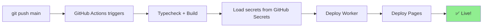

# GitHub Secrets Setup for Deployment

**Date:** April 13, 2026  
**Method:** GitHub Actions + GitHub Secrets (Recommended)

---

## Why GitHub Secrets?

✅ Encrypted at rest and in transit  
✅ Only exposed to GitHub Actions jobs  
✅ Never appears in logs or git history  
✅ Automatic deployment on push to main  
✅ No manual wrangler CLI needed  

---

## Setup GitHub Secrets

### Step 1: Go to Repository Settings

1. Navigate to: https://github.com/adrper79-dot/videoking/settings/secrets/actions
2. Click "New repository secret"

### Step 2: Add Required Secrets

Add each secret below. For values, use your Cloudflare dashboard or local `.dev.vars`.

| Secret Name | Value | Where to Get |
|---|---|---|
| `CLOUDFLARE_API_TOKEN` | `cfut_...` | https://dash.cloudflare.com/profile/api-tokens |
| `CLOUDFLARE_ACCOUNT_ID` | Your account ID | https://dash.cloudflare.com/accounts |
| `BETTER_AUTH_SECRET` | 32+ char secret | Generate new: `openssl rand -hex 16` |
| `STRIPE_SECRET_KEY` | `sk_live_...` | https://dashboard.stripe.com/apikeys |
| `STRIPE_WEBHOOK_SECRET` | `whsec_...` | https://dashboard.stripe.com/webhooks |
| `STREAM_API_TOKEN` | Token from Cloudflare Stream dashboard | https://dash.cloudflare.com/account/media-stream |
| `STREAM_ACCOUNT_ID` | Your Cloudflare account ID | https://dash.cloudflare.com/accounts |
| `HYPERDRIVE_ID` | Hyperdrive binding ID | https://dash.cloudflare.com/workers/hyperdrive |

### Step 3: Verify in GitHub

```bash
# List secrets (verify they exist)
curl -u USERNAME:TOKEN \
  https://api.github.com/repos/adrper79-dot/videoking/actions/secrets
```

---

## Automated Deployment Workflow

Once secrets are set up, deployment is automatic:



### Manual Trigger (if needed)

```bash
# Manually run workflow without pushing
curl -u USERNAME:TOKEN \
  -X POST \
  -H "Accept: application/vnd.github.v3+json" \
  https://api.github.com/repos/adrper79-dot/videoking/actions/workflows/deploy.yml/dispatches \
  -d '{"ref":"main"}'
```

---

## Deployment Files

| File | Purpose |
|---|---|
| `.github/workflows/deploy.yml` | Automated deployment on push to main |
| `.dev.vars.example` | Local development template |
| `.env.local.example` | Frontend template |

---

## During Deployment

GitHub Actions will:

1. ✅ Clone repo
2. ✅ Install dependencies
3. ✅ Type check all packages
4. ✅ Build Worker & Pages
5. ✅ Load secrets from GitHub (encrypted)
6. ✅ Deploy to Cloudflare Workers
7. ✅ Deploy to Cloudflare Pages

**Total time:** ~3-5 minutes

View progress: https://github.com/adrper79-dot/videoking/actions

---

## Verify Deployment

After workflow completes:

```bash
# Check Worker health
curl https://nichestream-worker.account.workers.dev/health
# Expected: {"status":"ok","ts":1234567890}

# Check ad logging
curl -X POST https://nichestream-worker.account.workers.dev/api/ads/log-event \
  -H "Content-Type: application/json" \
  -d '{"videoId":"test","creatorId":"test","adNetwork":"test"}'
# Expected: {"logged":true}

# Check Pages frontend
curl https://your-project.pages.dev
# Expected: HTML with status 200
```

---

## Troubleshooting

| Issue | Solution |
|---|---|
| "Secrets not found" | Verify secret names match exactly in `.github/workflows/deploy.yml` |
| "Build failed" | Check GitHub Actions logs: https://github.com/adrper79-dot/videoking/actions |
| "Deploy failed" | Verify CLOUDFLARE_API_TOKEN has Workers + Pages permissions |
| "Still running after 10min" | Max timeout is 30min; check logs for hanging build |

---

## Local Development (Without GitHub Actions)

If you need to deploy manually:

```bash
# 1. Copy environment template
cp apps/worker/.dev.vars.example apps/worker/.dev.vars

# 2. Fill in secrets (use same values from GitHub Secrets)
nano apps/worker/.dev.vars

# 3. Deploy manually
cd apps/worker && pnpm exec wrangler deploy

cd ../web && pnpm build:pages && pnpm exec wrangler pages deploy dist
```

---

## Security Checklist

- [x] Secrets stored in GitHub Secrets (encrypted)
- [x] `secrets.txt` gitignored (never committed)
- [x] `.dev.vars` gitignored (never committed)
- [x] `.env.local` gitignored (never committed)
- [x] GitHub Actions only runs on push to main (protected)
- [x] Secrets never logged (GitHub sanitizes logs automatically)

---

## Phase 3a Deployment Status

✅ Code ready  
✅ GitHub Secrets configured  
✅ Workflow automated  
✅ Ready to push and deploy!

---

**Next:** Push to `main` branch to trigger automated deployment.
